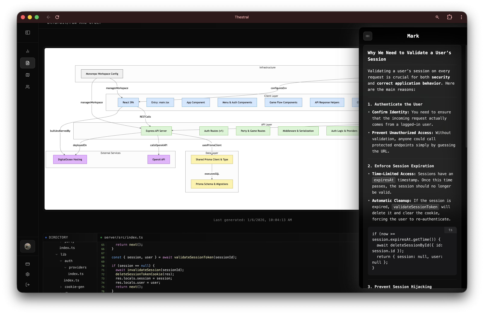

# Thestral

Thestral aims to allow any developer to contextualize a large codebase and make it digestable in order to contribute meaningfully.

### Technical Aspects

I used Retrieval Augmented Generation (RAG) to implement a chat bot that can effectively communicate to a user about functions inside of a massive Github repository.

The system diagram gets generated through AI reasoning about the important components present in the repository. The code generated is 100% written in `Mermaid.js`.

## License

This project is licensed under the Apache 2.0 License - see the [LICENSE](LICENSE) file for details.
